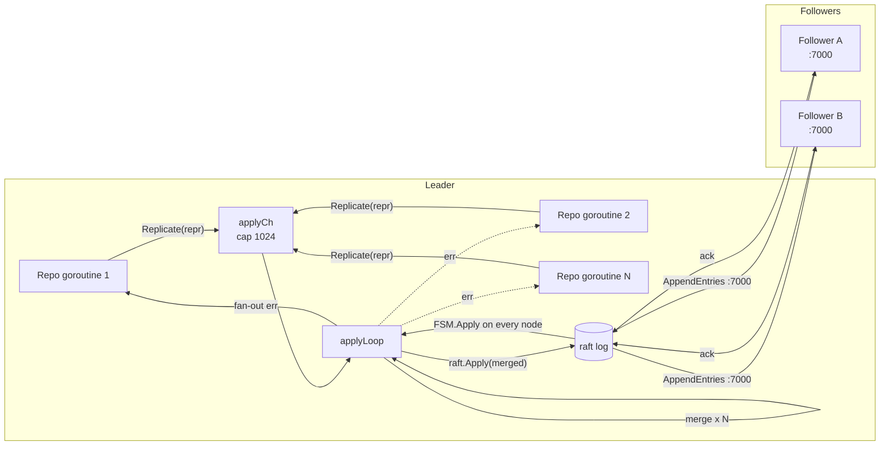

# IO Raft Replication

When codeQ runs as a single broker on a single node, the engine described on [IO Persistence Engine](IO-Persistence-Engine) is the whole story. When codeQ runs as a cluster, every write has to land on every replica in the same order, and the question of which node is currently allowed to accept writes has to have a definitive answer at all times. The replication layer that solves this is built on raft, the consensus protocol that turns a collection of independent state machines into a single replicated one with the same external semantics as the original.

This page describes how raft is wired into codeQ — what gets replicated, when the apply coalescer kicks in, what the FSM does on every replica, how the log and stable state and snapshots live alongside user data in the same engine, and what failover means in operational terms. The companion page [IO Mux Transport](IO-Mux-Transport) describes the network surface that carries raft traffic across nodes; the consensus protocol itself is summarised here only as far as is needed to understand the integration.

## The Hand-Off From The Engine

The persistence engine described earlier exposes a `Replicator` interface (`internal/repository/pebble/db.go:21-29`). Any object that knows how to ship a serialised batch through a replication protocol and wait for it to apply locally satisfies that interface; the raft package's `*raft.DB` does. The wiring happens once at startup with `AttachReplicator` (`internal/repository/pebble/db.go:103-108`). After that single call, every write that would have hit the group-commit coalescer goes through `repl.Replicate(batch.Repr())` instead.

The pattern matters. Two writers cannot share the same engine safely, so the engine wrapper retains its identity — the same `*pebble.DB` is read directly on every replica — but the write path swaps out. Reads stay local on every node (with the read-staleness that implies); writes go through raft and land on every replica through the FSM. The reason this works is that pebble batches serialise to a self-contained byte representation, `batch.Repr()`, that the raft layer can carry as opaque data and the receiving FSM can replay verbatim. The engine never has to know that replication is happening; the replicator never has to understand pebble's internal batch format.

The leader-only check is on the same boundary. `CommitBatch` in raft mode begins with `if !d.repl.IsLeader() { return ErrNotLeader }` (`internal/repository/pebble/db.go:322-331`). Followers reject writes synchronously and return a typed `NotLeaderError` that carries the current leader's HTTP base URL when known. Controllers turn this into an HTTP 307 redirect so smart clients can retry directly against the leader. This is the operational alternative to transparent proxying — the request hops the cluster on the client's clock, not on the server's, which keeps the broker's request budget bounded.

## What Raft Is Doing

Raft turns a write into a log entry, gets a majority of nodes to agree on the entry's position in the log, then asks every node to apply the entry to its local state machine. The protocol guarantees three things: every committed entry is on a majority of nodes' durable storage before it is considered committed, no two leaders ever issue conflicting entries at the same log position, and every replica's state machine processes entries in the same order. The combination is state machine replication — the textbook recipe for turning N independent state machines into one replicated one.

The leader runs an election when it starts or when it loses contact with the majority. Followers wait for heartbeats; if a heartbeat doesn't arrive within the election timeout, they become candidates and ask for votes. A majority of votes wins. The codeQ defaults are documented at `internal/raft/db.go:53-97`: heartbeat 1000 ms, election 1000 ms, leader lease 500 ms, commit timeout 50 ms, snapshot threshold 8,192 entries, snapshot interval 120 seconds. These are tuned for the LAN-scale clusters codeQ targets — three or five nodes in the same data centre with sub-millisecond ping times. Higher-latency deployments need higher timeouts; the field-by-field reasoning lives on [Operations Cluster Tuning](Operations-Cluster-Tuning).

AppendEntries is the per-write RPC. The leader takes a committed batch, packs it into a log entry, ships the entry to every follower in parallel, waits for a majority of acks, and then signals the entry as committed. Every node — leader and follower — then runs the entry through its FSM. The codeQ flow at `internal/raft/db.go:561-581` walks the steps explicitly: `CommitBatch` calls `d.raft.Apply(repr, timeout)`, which returns an `ApplyFuture`; the future's `Error()` blocks until the entry is committed and applied locally; the `Response()` field carries whatever the FSM returned. The HTTP request completes only after the local apply has finished. Followers may apply slightly behind the leader (raft batches AppendEntries in flight), but the leader's `CommitBatch` does not return until its own apply has run.

## The Apply Coalescer

The same pressure that motivated the engine-level group-commit coalescer reappears one level up. Raft's `Apply` call has its own fixed cost — log append, AppendEntries round-trip, FSM apply, engine commit — and that cost does not scale with the size of the entry payload. Concurrent `Replicate` calls without coalescing produce many small log entries, many round-trips, and many FSM applies. With coalescing, they produce one large entry, one round-trip, one apply.

The raft-side coalescer lives at `internal/raft/db.go:597-709`. Structurally it is a near-mirror of the engine-side coalescer with two material differences. The first is the merge ceiling — `raftMergeBatch=128` (`internal/raft/db.go:142-155`) rather than 64. The empirical sweet spot is higher because the fixed per-Apply overhead is larger; folding 128 batches into one Apply amortises across more operations before the merged entry size starts hurting the AppendEntries pipeline. Empirically, at 256 the merged batch starts exceeding raft's preferred entry size and throughput drops back to about 10,000 cycles per second — the same shape of curve as the engine-side coalescer, just with a higher peak.

The second difference is how batches are merged. The engine coalescer merges `*pebble.Batch` objects directly with `merged.Apply(b, nil)`. The raft coalescer carries serialised reprs because `Replicate` accepts `[]byte`. The applyLoop reconstructs each batch with `SetRepr`, merges with `Apply`, and submits the final merged repr to `raft.Apply` (`internal/raft/db.go:653-696`). The end result is identical: one log entry covers many submitters' worth of writes, and the FSM on every replica replays the merged batch as one unit.

The throughput lift the raft coalescer produces lands at thirty-to-fifty percent over the no-coalescer baseline on the three-node bench harness at `pkg/app/raft_grpc_bench_test.go`. Six-or-seven thousand cycles per second without coalescing; nine-or-ten thousand cycles per second with it. The bench methodology is on [Benchmarks Cluster](Benchmarks-Cluster).

## The FSM On Every Replica

Every node — leader and follower alike — runs the same finite state machine over the committed log. The codeQ FSM is at `internal/raft/fsm.go:43-62`. Its `Apply` method receives a `*hraft.Log`, ignores anything that isn't a `LogCommand` with non-empty payload, copies the payload to a fresh slice (raft reuses its dispatch buffers, so the FSM must not hold the pointer), reconstructs a batch with `batch.SetRepr(repr)`, and commits the batch with `pebble.NoSync`. That is the whole state transition: bytes in, durable write out.

The simplicity is load-bearing. Because every replica runs the same `SetRepr + Commit` sequence on the same input, every replica's engine ends up in the same state. There is no replay logic, no out-of-band synchronisation, no schema translation. The leader's batch and the follower's batch are byte-identical because batch `Repr()` is the canonical serialisation. The convergence guarantee comes from the raft protocol; the FSM just executes it.

What this implies for operational reasoning is worth stating explicitly. The leader's local apply runs the exact same code as every follower's apply. There is no leader-only code path on the write side. The leader's `Replicate` call appears synchronous to the caller, but mechanically what happens is the leader's apply runs through the FSM dispatcher just like the followers' applies, after the entry has been committed by the consensus protocol. This is why a leader that is also a follower (i.e. always) is not a special case — it is the normal case.

The FSM also implements `Snapshot` and `Restore`. `Snapshot` captures a point-in-time `pebble.Snapshot` synchronously inside the raft FSM lock, then streams it to the snapshot sink in the codeQ-specific format described in `internal/raft/snapshot.go:42-50`. `Restore` wipes the local `codeq/` key range and re-populates from the stream — a clean overwrite, not a merge. Snapshots are how the cluster bounds the log: every 8,192 entries (the default `SnapshotThreshold`) or every 120 seconds (the `SnapshotInterval`), the leader takes a snapshot and truncates the log up to that point. Followers receive snapshots via `InstallSnapshot` when their log has fallen too far behind to catch up entry-by-entry.

## Where Raft State Lives

A raft node has three durable resources besides the FSM itself: a log store for committed entries, a stable store for term and vote state, and a snapshot store for FSM snapshots. codeQ puts all of them on the same engine instance the FSM uses, under distinct prefixes that do not collide with user data.

The log store lives at `internal/raft/log_store.go`. Entries are keyed `raft/log/<be8 index>` and serialised with msgpack (the same wire shape `hashicorp/raft-boltdb` uses, so the format is unsurprising). `StoreLogs` writes a batch of new entries atomically; `DeleteRange` discards entries below the latest snapshot or above a stale follower's commit point. `FirstIndex` and `LastIndex` bound the live log with iterator first/last calls.

The stable store lives at `internal/raft/stable_store.go`. Term, vote, and a handful of small durable counters live under `raft/stable/<key>`. The contract is: a missing key returns a zero value, not an error. This matches both the documented `StableStore` semantics and what hashicorp/raft actually expects.

The snapshot store is a file-based store at `<path>/snapshots/`, configured with retain=3 (`internal/raft/snapshot.go:21-26`). The last three snapshots stay on disk for crash recovery and slow-follower catch-up; older ones are purged automatically. The format itself is internal — magic bytes `CDQS`, a version field, then a sequence of length-prefixed key/value entries terminated by an EOF tag. Bumping the version field is the breakage primitive should the on-wire shape ever need to change.

The reason all of this lives on the same engine as the FSM is operational simplicity. One data directory, one open engine, one set of metrics, one fsync policy. The prefixes — `codeq/` for user state, `raft/log/` for the log, `raft/stable/` for the stable store, plus the on-disk snapshot directory — never collide and are documented inline at `internal/repository/pebble/keys.go:25-59` and the corresponding constants in the raft package.

## AppendEntries Over The Mux Transport

The wire protocol between raft nodes is hashicorp/raft's `NetworkTransport`, which speaks a small RPC dialect over a stream-oriented connection. codeQ does not modify that protocol. What it does is run the protocol over a multiplexed listener: every node binds one TCP port (`:7000` by default), and every raft group on that node shares the listener through a four-byte big-endian group ID prefix at the start of each connection. The wire shape is described on [IO Mux Transport](IO-Mux-Transport).

For a single raft group (the default codeQ deployment), the mux is invisible — there is one group, one stream layer, one TCP port. For sharded deployments, the mux becomes load-bearing: each shard has its own raft group with its own log and snapshot, and all groups share the same listener. The configuration knob is `StreamLayer` on the raft `Config` struct (`internal/raft/db.go:46-51`). When non-nil, `Open` uses `hraft.NewNetworkTransport` on top of the supplied stream layer instead of opening its own TCP listener via `NewTCPTransport`. Code path divergence at `internal/raft/db.go:231-244`.

## Failover

A leader that stops sending heartbeats — because the process crashed, the node lost network, the disk wedged — is detected by every follower within one election timeout (1000 ms by default). One of the followers becomes a candidate, requests votes, and either wins (becoming the new leader) or loses (and tries again on the next timeout). The cluster is leaderless for at most a few hundred milliseconds in the common case, longer if multiple candidates split votes and the protocol has to retry. Every uncommitted write at the moment of failure either commits on the new leader (if it had reached a majority before the failure) or is dropped (if not); the client sees a `NotLeaderError` and retries, and the retry's idempotency key protects against double-processing.

The leader-info channel `LeaderObservation` (`internal/raft/db.go:386`) is the broker's hook to react to leadership changes. The lease reaper, for instance, only runs on the leader; it subscribes to the leader channel and starts/stops as the role flips. The HTTP `LeaderHTTPAddr()` method (`internal/raft/db.go:404-410`) gives the broker the leader's HTTP URL for the redirect response.

A failover scenario walks through this. Three nodes — A, B, C — with A as leader. A's process dies. B's heartbeat timer fires after 1000 ms; B becomes a candidate and asks C for a vote. C votes yes (it has not heard from A either). B becomes leader. Every client request that landed on A during the dying-process window failed with a connection error; every client request that landed on B or C between the death and the election failed with `NotLeaderError`-but-no-leader-URL (because the leader was genuinely unknown). After the election, B starts accepting writes. Clients retry, hit the new leader directly (because their last `NotLeaderError` either had the new leader's URL or they probe), and traffic resumes. The total unavailability window is dominated by the election timeout. The operational specifics — health checks, restart loops, recovery from minority partitions — are on [Concepts Cluster Level Failover](Concepts-Cluster-Level-Failover).

## What Replication Does Not Cover

Sharding — distributing different keys across different raft groups — is a different concern from replication. Replication makes one logical store survive node failure; sharding makes a logical store larger than one node can hold. codeQ supports both, but they are orthogonal mechanisms. Replication is per-raft-group; sharding is the existence of multiple raft groups on the same nodes. See [Concepts Cluster Shards](Concepts-Cluster-Shards) for the sharding model.

Read consistency is local. Followers serve reads from their local engine, which may be slightly stale relative to the leader. This is the standard raft trade — strong consistency on writes, eventual consistency on reads — and the codeQ controller does not paper over it. Clients that need strong reads can route their queries through the leader explicitly via the redirect response. Most broker reads (task fetch by ID, queue stats, lease state) tolerate small staleness because the workflow is inherently eventually-consistent anyway.

Cross-region replication is not in scope. The default timeouts (1000 ms heartbeat and election) make cross-region raft pathological on every dimension — election storms during transient partitions, slow commits because every AppendEntries pays a regional RTT, large log replication windows because followers lag and need snapshots constantly. The supported topology is single-region clusters of three or five nodes with sub-millisecond ping times.

The pages that complete the picture: [IO Persistence Engine](IO-Persistence-Engine) describes what every replica is writing into; [IO Group Commit Coalescer](IO-Group-Commit-Coalescer) describes the analogous mechanism on the local engine that the raft path bypasses; [IO Mux Transport](IO-Mux-Transport) describes the wire shape that carries AppendEntries; [Concepts Cluster Shards](Concepts-Cluster-Shards) and [Concepts Cluster Level Failover](Concepts-Cluster-Level-Failover) cover sharding and failover at the conceptual level; [Benchmarks Cluster](Benchmarks-Cluster) documents the measured throughput.
