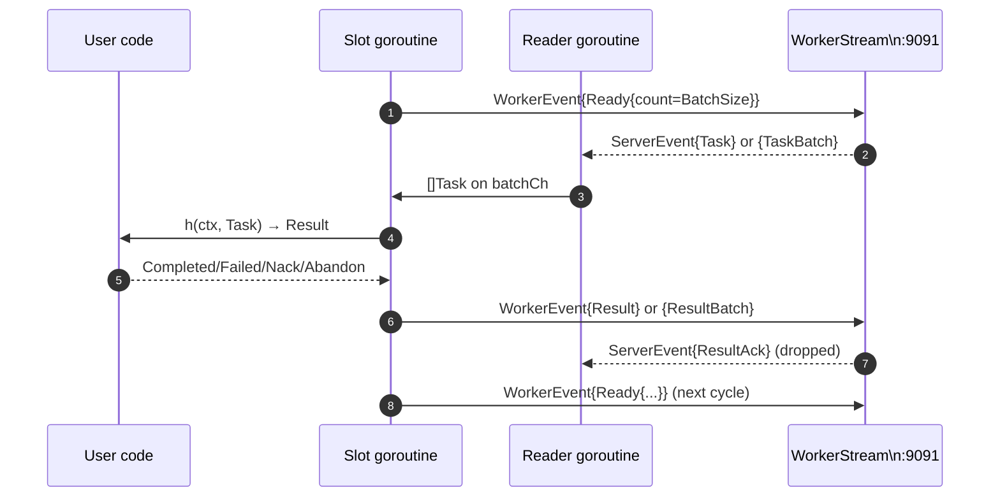

# IO Worker Stream

The worker stream is the symmetric counterpart of the producer stream: a bidirectional gRPC service on port `:9091`, defined by the `WorkerStream.Stream` rpc in `internal/worker/workerpb`. A worker process opens one stream per connection, sends Hello once to authenticate, and then loops Ready → Task → Result for the lifetime of the session. The server pushes Task assignments down the same stream when claims succeed and accepts Result, Nack, Heartbeat, and Abandon events from the worker. One stream can host an arbitrary number of concurrent slots — the SDK runs them in parallel goroutines, each issuing its own Ready and processing its own Task independently of the others.

The motivation is the same as the producer stream: bypass the HTTP middleware tax that dominated CPU on the REST claim path. Every `POST /v1/codeq/tasks/claim` paid for authentication, rate limiting, JSON parsing, and the response writer's mutex on every claim attempt. A worker pool processing tens of thousands of tasks per second cannot pay that cost. On the worker stream, Hello authenticates the session exactly once, the rate limiter sees one logical worker rather than thousands of claim attempts, and the wire format is a protobuf message that needs no JSON detour. The bench in `internal/bench/worker_stream_vs_rest_bench_test.go` measures the difference; the stream sustains the full-cycle throughput of 76,639 tasks per second on a single node.

## Wire shape

A worker stream session has a strict opening handshake and an open-ended event loop. The first message the client sends must be `WorkerEvent{Hello{token, workerId}}`. The server validates the bearer token against its `auth.Validator`, looks up the tenant from the claims, intersects the worker's allowed `eventTypes` with the requested Commands, and replies with `ServerEvent{HelloAck{workerId, tenantId}}`. The HelloAck fixes the worker identity for the rest of the session: every subsequent Ready inherits that identity, so the wire does not carry the workerId again.

After HelloAck, the worker enters an open-ended loop. Each cycle has three phases. First, the worker sends `Ready{commands, leaseSeconds, count}` to request work. The server consults the scheduler — calling `ClaimTask` for `count<=1` or `ClaimManyTasks` for `count>1` — and either replies with a `Task` or `TaskBatch` or holds the Ready open until something becomes available, polling internally with a 50-millisecond delay up to roughly thirty seconds. Second, when a Task arrives, the worker invokes the user's handler. Third, the worker sends `Result` or `ResultBatch` with the disposition, or `Nack`, or `Abandon`, depending on what the handler returned.

Heartbeats are a side path. While a handler is running, the SDK's lease keeper can send `Heartbeat{taskId, extendSeconds}` to push the lease forward. The server replies with `HeartbeatAck` carrying ok or an error. The default SDK does not send heartbeats automatically; the handler is expected to finish within the lease, and applications that need long-running handlers must extend the lease explicitly. Heartbeat exists primarily for the REST path where slow workers must signal liveness without the underlying gRPC stream's keep-alive.

## Slot loop

The SDK runs N slots in parallel where N is `Config.Concurrency`. Each slot is its own goroutine running the same loop independently of the others; they share only the stream's writer goroutine and reader goroutine. The slot loop, in pseudocode, is straightforward: send Ready, wait for Task, invoke handler, submit Result, repeat.



The reader and writer goroutines are session-scoped, not per-slot. The reader drains `stream.Recv()` in a loop and routes incoming Task and TaskBatch events to the shared `batchCh`; any slot that is currently waiting on the channel picks them up. The writer drains `sendCh` and serializes outbound events through one `stream.Send` call site. This separation is what lets N slots run concurrently without each one owning its own stream — the cost of opening N streams (N TCP connections, N Hello handshakes, N tenant lookups) would defeat the point.

The slot loop in `pkg/workerclient/client.go:317` is intentionally simple. It sends Ready, blocks on `batchCh`, dispatches the resulting batch, and loops back to send the next Ready. There is no retry on transient errors at the slot level — if a Ready send fails, the slot logs a warning and exits, and the run loop tears down. Higher-level resilience (reconnect, redial, backoff) is the application's job. The SDK aims for predictable behavior at the cost of self-healing complexity.

## Result constructors

A handler returns a `Result` value built from one of four constructors. The constructors live in `pkg/workerclient/result.go` and map directly onto the four possible dispositions of a claimed task.

`Completed(body map[string]any)` marks the task done. The body is the result payload; the SDK JSON-encodes it and the server records it on the task record. The body can be nil, in which case the task is marked complete with no payload. A worker that needs to return structured data (a generated PDF's URL, a transcoded media manifest, a webhook response) returns it via the body and the server surfaces it on `GET /v1/codeq/tasks/<id>/result`. See [IO-REST-API](IO-REST-API) for the result fetch path.

`Failed(err string)` marks the task as failed. The string is recorded as the error message. The scheduler respects the task's `MaxAttempts` setting: failures below the limit return the task to pending for a retry, failures at the limit move the task to the dead-letter queue. The distinction between Failed and Nack is intent: Failed means "the handler tried and could not produce a result"; Nack means "the handler chose not to try right now". Both consume an attempt but Nack additionally schedules a delay.

`Nack(delaySeconds int, reason string)` puts the task back on the queue after `delaySeconds`. The delay is clamped to zero on the SDK side; the server applies any additional clamp from the queue's retry policy. The reason is recorded for observability and surfaces on `GET /v1/codeq/tasks/<id>`. Nack is the right choice when a worker hits a recoverable upstream error (rate limit, transient network, locked row) and wants the task to be retried later. The delay should be tuned to the underlying error: short for transient network blips, longer for upstream rate limits.

`Abandon()` releases the lease without nacking or failing. The task goes straight back to pending and another worker can claim it immediately. Abandon is the right choice when a worker is shutting down cleanly mid-task: it does not consume an attempt, so the next worker that claims the task starts on the same attempt counter. A graceful shutdown handler that detects SIGTERM and wants to hand off in-flight tasks returns Abandon for everything it has claimed but not finished.

The four constructors are all the SDK exposes. There is intentionally no zero-value Result — a handler that returns `workerclient.Result{}` triggers an error in `applyResult`, because ambiguous zero values are worse than a clear panic. Handlers must explicitly choose one of the four dispositions.

## Lease renewal

The lease is the time window in which the claiming worker has exclusive ownership of the task. When a worker sends Ready, the server reserves the task for `leaseSeconds` (or the server's default if Ready specifies zero). If the worker does not submit a Result, Nack, or Abandon within the lease, the server treats the task as orphaned and returns it to the queue for another worker to claim. The lease is a coarse-grained liveness mechanism; it does not depend on TCP keep-alive or gRPC heartbeats.

For long-running handlers there are two strategies. The first is to request a longer lease at Ready time by setting `Config.LeaseSeconds` to a value above the expected handler duration. This is the simplest path: a handler that always takes around two minutes should request a lease of three or four minutes. The second is to send Heartbeat events from the handler to push the lease forward incrementally. Heartbeat is `WorkerEvent{Heartbeat{taskId, extendSeconds}}`; the server handles it in `internal/worker/server.go:487`. The SDK does not auto-heartbeat in this release, so applications that want auto-heartbeat must wire it themselves.

The trade-off between long initial leases and explicit heartbeats is the same as in every distributed lease system. Long leases waste capacity if the worker dies — no other worker can claim the task until the lease expires. Short leases with heartbeats minimize wasted capacity but cost network traffic and add the failure mode where a heartbeat is dropped and the task gets reclaimed. The default lease in the server config is sixty seconds, which is conservative enough for most handlers and short enough that a dead worker's tasks are reclaimed in under a minute.

## Backpressure

The writer-goroutine channel is the same 256-slot buffer the producer stream uses (`internal/worker/server.go:98`). Per-event handler goroutines push acks into the channel, and the writer drains them. When the channel saturates, handlers block until the writer flushes capacity or the stream context fires. The block path is non-allocating and bounded, so a worker that has fallen behind on Result submissions does not accumulate unbounded memory on the server.

On the client side, the same 256-slot buffer fronts outbound sends. `pkg/workerclient/client.go:169` declares `sendChanBufferClient`. Each slot's Ready and Result push into this buffer; the writer goroutine drains it through `stream.Send`. Under heavy load with many slots, a slot can block waiting for capacity, which is the right behavior — it provides explicit flow control without dropping events. The block falls through on `ctx.Done()` so a context cancellation unblocks the entire fleet of slot goroutines.

The reader goroutine has no buffering for incoming tasks. The `batchCh` is unbuffered. A Task or TaskBatch arrives, the reader posts it on `batchCh`, and whichever slot is currently waiting in `select` picks it up. If no slot is waiting (because all N slots are busy executing handlers), the reader blocks on the channel send until one becomes free. This blocks the reader, which blocks the next `stream.Recv()`, which signals to the server's flow control that the worker is saturated. The server stops issuing Tasks until the worker drains.

## Batching

`Config.BatchSize` controls two related optimizations. When set to one (the default), each Ready requests exactly one Task, the server replies with one Task, the handler runs once, and the slot submits one Result. This is the legacy single-task path: it preserves the simple mental model and the lowest possible latency per task at the cost of one full Ready→Task→Result round trip per task.

When set higher than one, each Ready requests `BatchSize` Tasks via `Ready{count=BatchSize}`, the server replies with a TaskBatch carrying up to that many Tasks, the slot dispatches all of them to the handler in sequence, and the resulting Completed/Failed results coalesce into one `ResultBatch` on the way back. Nack and Abandon results fall back to per-message sends because the server's `BatchSubmit` path only accepts Completed and Failed; they are rare under load so the per-message penalty is acceptable.

Batching amortises the gRPC framing cost (one Recv plus one Send per N tasks instead of N each) and the Pebble commit cost (one `BatchUpdateTasksOnComplete` per N tasks instead of N commits). On a worker pool processing tens of thousands of tasks per second, the difference is significant — see the same bench file for measured numbers. The trade-off is per-task latency: in batch mode, a handler's result is not visible to the server until the entire batch finishes. Applications that need per-task ack semantics should leave BatchSize at one; applications that just need throughput should set it to eight or sixteen.

## Code example

The high-level entry points are `workerclient.New` to build a Client and `Run(ctx, Handler)` to start dispatching tasks. The Handler is a function with signature `func(ctx context.Context, t Task) Result`. Run blocks until ctx fires or the stream dies.

```go
package main

import (
    "context"
    "log"

    "github.com/osvaldoandrade/codeq/pkg/workerclient"
)

func main() {
    cli, err := workerclient.New(workerclient.Config{
        Addr:         "localhost:9091",
        Token:        workerToken,
        WorkerID:     "worker-1",
        Commands:     []string{"send-email"},
        Concurrency:  4,
        LeaseSeconds: 60,
        BatchSize:    1,
    })
    if err != nil {
        log.Fatal(err)
    }
    defer cli.Close()

    handler := func(ctx context.Context, t workerclient.Task) workerclient.Result {
        log.Printf("processing %s command=%s payload=%s", t.ID, t.Command, t.Payload)
        if err := sendEmail(t.Payload); err != nil {
            return workerclient.Nack(30, err.Error())
        }
        return workerclient.Completed(map[string]any{
            "sentAt": time.Now().UTC().Format(time.RFC3339),
        })
    }

    if err := cli.Run(context.Background(), handler); err != nil {
        log.Fatalf("run: %v", err)
    }
}
```

The example shows the four-result idiom: Completed with a payload on success, Nack with a delay and a reason on transient failure. Failed and Abandon are equally short. The handler must be safe to call concurrently because the SDK runs `Concurrency` slots in parallel; in the example above, four slots are processing four tasks at once on one stream.

A worker that wants to batch its work changes one knob: `Concurrency: 4, BatchSize: 8`. The SDK then runs four slots, each pulling up to eight tasks per Ready and submitting up to eight Results per cycle. The handler signature is identical; the SDK invokes it once per task in the batch and collects the results into one ResultBatch on the way back. Whether to batch is purely a throughput-versus-latency trade-off; the SDK supports both with the same handler interface.

## Task fields visible to the handler

The Task struct in `pkg/workerclient/result.go:11` exposes the fields a handler typically needs: ID, Command, Payload, Priority, Attempts, MaxAttempts, TenantID, Webhook, LeaseUntil. The full domain.Task on the server side has additional bookkeeping fields (CreatedAt, UpdatedAt, WorkerID, Status) that the client does not need. Handlers that need those fields can fetch them via `GET /v1/codeq/tasks/<id>` over REST; see [IO-REST-API](IO-REST-API) for the surface.

Payload is opaque bytes. CodeQ does not parse it or validate it; the producer chose its shape and the handler is responsible for understanding it. Most applications use JSON because the producerclient accepts `[]byte` and the workerclient hands `[]byte` back, but the wire is binary-safe and any encoding works. Attempts and MaxAttempts let the handler reason about retry budget — a handler can choose to give up early (Failed) on the last attempt to avoid pointless retries.

## When to choose the stream

The stream is the right choice for any long-running worker process. Workers naturally amortise the Hello cost across their lifetime, and the stream's per-claim cost is essentially zero compared to REST. Short-lived script-style workers (a cron job that processes one batch and exits) can use REST because the Hello cost would not amortise; everything else should use the stream.

A common deployment pattern is one stream per worker process with `Concurrency` matched to the number of CPU cores. A four-core worker box runs one process with Concurrency=4 and BatchSize=8, which gives a healthy mix of parallelism and amortisation. Increasing concurrency past CPU count rarely helps because the bottleneck moves from gRPC framing to handler execution; doubling slots when handlers are CPU-bound just adds context-switch overhead. See [Concepts-Workers](Concepts-Workers) for the model and [Performance-Tuning](Performance-Tuning) for the tuning guidance.

The 76,639 tasks-per-second number reported in `internal/bench/profile_full_cycle_test.go` is a single-node ceiling with a tight handler that returns Completed with a small payload. Real handlers do more work and most realistic deployments are bottlenecked on handler logic, not on codeq's IO. The worker stream's value is that codeq's IO never becomes the bottleneck — the handler's own work is.
