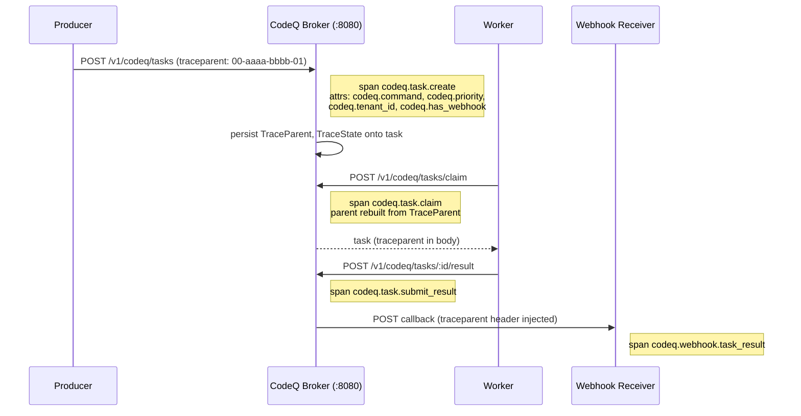

# Observability: Distributed Tracing

Distributed tracing answers a single question with great precision: of all the steps a request took across all the processes it visited, which one took the time? In a synchronous system the question is mechanical because the call stack of a single goroutine is the trace. In an asynchronous broker like CodeQ the trace must survive a hand-off through durable storage: a producer enqueues a task at time T, a worker claims that task at time T + minutes, completes it, and posts a webhook callback. None of those steps share a goroutine, a TCP connection, or even a process; the only thread between them is the data on disk. CodeQ's tracing design encodes that thread as W3C trace context strings persisted on the task itself, so the chain can be reconstructed without any out-of-band coordination.

This page documents how that works, what spans the broker emits, what attributes those spans carry, how the W3C `traceparent` and `tracestate` headers flow into and out of CodeQ, and how the OTLP exporter is configured. It assumes basic familiarity with OpenTelemetry concepts — trace, span, parent span, sampling — but spends most of its time on the specific decisions in `internal/tracing/tracing.go` and the call sites in `internal/services/` and `internal/repository/`.

## W3C Trace Context as the wire format

The W3C Trace Context recommendation defines two HTTP headers, `traceparent` and `tracestate`, that together encode the identity of the current span and any vendor-specific routing information. The `traceparent` value has a fixed structure of four hyphen-delimited fields: a version byte, a 16-byte trace ID in hex, an 8-byte parent span ID in hex, and a flags byte (the only meaningful bit being the "sampled" flag). The `tracestate` value is a comma-delimited list of vendor key-value pairs that participating tracers may use to carry routing hints. CodeQ uses these strings as the canonical representation of trace context throughout the system; they are what gets persisted on the task and what gets injected into outbound webhook requests.

The choice of W3C Trace Context over a vendor-specific scheme is deliberate. It lets a producer that uses a Java instrumentation library propagate trace context to a CodeQ broker written in Go, which then propagates it to a worker written in any language, which then propagates it back through a webhook to a receiver written in yet another language, and at no point does any component need to know any other component's tracer implementation. The propagator is configured in `internal/tracing/tracing.go:108-113` as a composite of `TraceContext` and `Baggage`, set unconditionally — even when tracing is disabled — so that headers flow through CodeQ untouched if some downstream component is instrumented separately. That single decision is what makes CodeQ a good citizen in a heterogeneous traced environment rather than a black hole in the middle of someone else's trace.

## The lifecycle of a traced task

A task is born inside `SchedulerService.CreateTask` at `internal/services/scheduler_service.go:95-104`. The very first thing that function does, before validating the command or parsing the webhook URL, is open a span:

```go
ctx, span := otel.Tracer("codeq/scheduler").Start(ctx, "codeq.task.create",
    trace.WithAttributes(
        attribute.String("codeq.command", string(cmd)),
        attribute.Int("codeq.priority", priority),
        attribute.Bool("codeq.has_webhook", strings.TrimSpace(webhook) != ""),
        attribute.Bool("codeq.has_idempotency_key", strings.TrimSpace(idempotencyKey) != ""),
        attribute.String("codeq.tenant_id", tenantID),
    ),
)
defer span.End()
```

Five attributes are attached eagerly. `codeq.command` is the high-cardinality dimension that drives almost every downstream filter; it appears as a label on metrics, a span attribute on traces, and a structured field on log lines. `codeq.priority` lets you correlate latency anomalies with priority lane usage. `codeq.has_webhook` is intentionally a boolean rather than the URL itself, because the URL is unbounded cardinality and may contain secrets; the boolean tells you whether to expect a downstream webhook span. `codeq.has_idempotency_key` lets you correlate duplicate-create attempts with idempotency hits without leaking the key value. `codeq.tenant_id` is the most useful dimension for multi-tenant operations — almost every "is this incident affecting one customer or all customers" question begins with a filter on this attribute.

When the repository layer accepts the enqueue, it asks the tracing helper for the W3C strings of the current span and persists them onto the task. At `internal/repository/task_repository.go:384-386` the call is:

```go
if tp, ts := tracing.TraceContextStrings(ctx); tp != "" {
    task.TraceParent = tp
    task.TraceState = ts
}
```

`tracing.TraceContextStrings` lives at `internal/tracing/tracing.go:135-139` and is a thin wrapper that uses the global text-map propagator to inject the span context into a `MapCarrier`, then reads back the `traceparent` and `tracestate` keys. The result is two strings, both safe to serialize as JSON, both stable across process restarts. The `domain.Task` struct at `pkg/domain/task.go:42-43` declares these fields with `json:"traceParent,omitempty"` tags so they round-trip through any storage layer that speaks JSON, and through the protobuf types in `internal/cluster/clusterpb/clusterpb.pb.go:62-63` and `internal/producer/producerpb/producerpb.pb.go:106-107` for the cluster gRPC and producer streaming paths.

Later, when a worker claims the task, the broker rebuilds a parent context from those persisted strings. At `internal/repository/task_repository.go:857-879` and `internal/repository/pebble/task_repository.go` the claim path calls `tracing.ContextWithRemoteParent(ctx, t.TraceParent, t.TraceState)` (`internal/tracing/tracing.go:142-156`) to extract the trace context from the persisted strings back into a new `context.Context`, then opens a child span called `codeq.task.claim` parented to that remote context. The result is that the `claim` span appears in Jaeger as a child of the `create` span, even though the two events are minutes apart and live in different goroutines. The same pattern repeats for `codeq.task.heartbeat` at line 941, `codeq.task.abandon` at line 989, `codeq.task.nack` at line 1051, and `codeq.task.submit_result` in `internal/services/results_service.go:49-50`. The repository layer's tracing tracer is named `codeq/repository`; the services layer's are `codeq/scheduler`, `codeq/results`, `codeq/notifier`, and `codeq/result_callback`.

The webhook callback closes the loop. When the broker delivers a result to the producer's callback URL, it injects the current trace context into the outbound HTTP headers using `tracing.InjectHeaders` (`internal/tracing/tracing.go:158-163`) at `internal/services/result_callback_service.go:125` and `internal/services/notifier_service.go:168`. A receiver that participates in the W3C standard sees the `traceparent` header on the incoming POST and continues the trace; a receiver that does not still gets the header as an opaque value it can log for cross-referencing. From CodeQ's side the chain is complete: `codeq.task.create` → `codeq.task.claim` → `codeq.task.heartbeat` (zero or more) → `codeq.task.submit_result` → `codeq.webhook.task_result`.



## OTLP exporter configuration

The exporter is configured at process boot in `internal/tracing/tracing.go:31-106` and driven by five YAML keys in `pkg/config/config.go:22-26`:

- `tracingEnabled` — gate. Default false. When false, the SDK is not initialized; the propagator is still set so headers flow through.
- `tracingServiceName` — the `service.name` resource attribute. Default `codeq` (or `OTEL_SERVICE_NAME` env var). This is the name you will see in Jaeger.
- `tracingOtlpEndpoint` — gRPC endpoint of the collector. Default `localhost:4317`. URLs are accepted and sanitized down to `host:port` by `sanitizeEndpoint` at line 115.
- `tracingOtlpInsecure` — use plaintext gRPC. Default false. Set true when the collector is on the same node or behind a service mesh that terminates TLS.
- `tracingSampleRatio` — head-based sampling rate, applied through `sdktrace.TraceIDRatioBased`. Default 1.0 (sample everything). Wrapped in `ParentBased` so that an upstream sampling decision is honored — if a producer marks `traceparent` as sampled, the broker respects that even if its own ratio would have dropped the trace.

The wrapping in `ParentBased(TraceIDRatioBased(r))` is worth lingering on. Head-based sampling at the broker alone would cause a producer that sampled at 100% to lose 90% of its traces inside CodeQ if the broker were configured at 10%, which would defeat the entire point of a distributed trace. The parent-based decorator says: "if my parent has a sampling decision, use it; otherwise roll the dice at my ratio." That preserves end-to-end traces even when individual services run different sample rates. Environment variables override config: `OTEL_EXPORTER_OTLP_ENDPOINT` and `OTEL_EXPORTER_OTLP_INSECURE` both win over the YAML values, which is the standard OpenTelemetry convention and lets you flip endpoints without restarting the deploy pipeline.

If the exporter fails to initialize — collector unreachable, TLS handshake fails, DNS lookup times out — `Setup` logs a warning and returns a no-op shutdown function. Tracing fails open. This is deliberate. A broker that refuses to start because a telemetry sidecar is down is a broker that cannot survive a regional outage of its observability stack, and CodeQ optimizes for the broker's availability over the completeness of the trace export. The cost is that you must monitor *whether* the exporter is exporting, which is best done through the collector's own metrics rather than from CodeQ.

The shutdown function returned by `Setup` is invoked from `cmd/server/main.go:90-94` on SIGTERM with a five-second deadline. That deadline is enough for the batcher to flush its queue under nominal conditions; under load you may lose a small tail of spans on shutdown. The trade-off is that the broker drains the HTTP server first, so the spans that matter most — those of in-flight requests — get to End before Shutdown fires.

## Span attribute conventions

The broker uses a single namespace prefix for custom attributes: `codeq.*`. This keeps custom attributes from colliding with the OpenTelemetry semantic conventions (`http.*`, `rpc.*`, `db.*`) that come from instrumentation libraries. Within `codeq.*` the convention is to favor low cardinality. `codeq.command` is bounded by the set of commands you have registered. `codeq.priority` is bounded to a small integer range. `codeq.has_webhook` and `codeq.has_idempotency_key` are booleans. `codeq.tenant_id` is the one moderately high-cardinality attribute, but it is bounded by the number of tenants — small enough for any reasonable trace backend to index efficiently.

What you will *not* find on a span is the payload, the webhook URL, the idempotency key, or any other free-form string from the request. Trace backends are not designed to be your secrets store, and they are not designed to be your structured log store either. The trace tells you which steps happened and how long each took; the structured log tells you what each step was carrying. Keeping that separation makes it safe to share traces with vendors, with sister teams, and with auditors, because the trace itself contains no business data.

## Sampling: what to set and why

For a broker that handles tens of thousands of tasks per second, sampling at 100% is rarely the right call in production. The exporter, the collector, and the trace backend all charge per span, and the marginal value of the millionth identical trace is zero. CodeQ defaults `tracingSampleRatio` to 1.0 because the default is for development; in production a value between 0.01 and 0.1 is typical, with the understanding that the parent-based sampler will let through traces that an upstream service has decided to keep. If you need to investigate a specific tenant or command, the right pattern is to keep the head-based sample low and use the trace backend's tail-based sampling features (or a collector-side tail sampler) to retain everything that hits an error condition or exceeds a latency threshold. That is a deployment topology rather than a code change, so it is documented in the trace backend's runbook rather than here.

## What tracing does not tell you

Tracing is causal but not exhaustive. A span tells you that step X took 800ms; it does not tell you which goroutine inside step X was on CPU, which mutex was contended, or how much memory was allocated. For those questions you need [Observability Profiling](Observability-Profiling). Tracing also does not aggregate well: you cannot answer "what is the p99 of `codeq.task.claim` across all tenants in the last hour" from traces alone unless you have configured your backend to roll spans up into metrics. The right place to ask that question is the histogram in `internal/metrics/metrics.go`, documented in [Observability Metrics](Observability-Metrics). Finally, tracing does not preserve narrative: the order of events within a span is implicit in their start times, not explicit in a sequence. For "what did this specific task do, in what order, with what error message," the answer is in the structured logs documented in [Observability Logging](Observability-Logging), each of which carries the same `traceparent` so the trace and the log line are mechanically joinable.

The strength of distributed tracing in CodeQ is that it makes the asynchronous causality of a task — create here, claim there, complete somewhere else, callback to a fourth place — into a single visual chain. That is the question for which there is no substitute, and it is what the rest of the observability stack hangs off.
