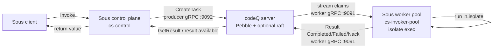

# Sous Functions Get Started

This page is the integration-level quickstart for running Sous on top of codeQ. It explains the topology a developer needs to stand up, points at the [Sous repository](https://github.com/osvaldoandrade/sous) for the Sous-side installation steps, and describes what codeQ sees while the integration is running. It deliberately does not document the Sous CLI, the function authoring contract, or the isolate runtime — those are Sous's domain and are covered in the Sous repository's own README and docs. If you are reading this page in order to write a function, click through to Sous first and come back here once you have a running invocation that needs to talk to a real queue.

The starting point is the project description from the Sous repository: "SOUS is a serverless execution layer for agent automation, deploying functions without compilation. The platform ensures runtime parity between local and cluster, executing functions in secure isolates." Everything below builds on that sentence and the [Concepts](Sous-Functions-Concepts) page, which explains the wire model and the lifecycle.

## The integration shape

Sous is split into three runtime pieces. The control plane, packaged as `cs-control` in the Sous repository, accepts invocation requests from end clients, enforces tenant rules, and translates each accepted request into a `CreateTask` event on codeQ. The worker pool, packaged as `cs-invoker-pool`, is the side that actually runs functions: each replica opens a worker stream to codeQ, claims tasks, hydrates the named function into an isolate, runs it, and reports the result. The CLI, `cs`, is what developers use to register functions, list invocations, and inspect results.

All three pieces are deployed against an existing codeQ instance. codeQ does not have to be reconfigured for Sous; it has to be reachable, it has to issue JWTs that the Sous control plane and worker pool can present, and it has to have enough capacity to absorb the workload Sous is about to send it. Everything else is on the Sous side. The reason this page exists is that operators who are responsible for codeQ usually also have to keep Sous running, and the integration boundary is worth seeing in one place.

The diagram is the canonical reference for which port carries which traffic. The producer port `:9092` is the inbound side of codeQ from the Sous control plane. The worker port `:9091` is the bidirectional stream between codeQ and each worker pool replica. Both ports are public codeQ surfaces documented on [IO Overview](IO-Overview), and Sous is one of many possible consumers — anything that speaks the same protocol can use them.

## What you need before you start

The integration assumes three preconditions. The first is a running codeQ instance reachable from wherever Sous will run. The codeQ Get Started section covers the supported deployment modes: [Run Locally](Get-Started-Run-Locally) for a single-node developer setup, [Run In Docker](Get-Started-Run-In-Docker) and [Docker Compose](Get-Started-Run-With-Docker-Compose) for containerised setups, and [Kubernetes](Get-Started-Run-In-Kubernetes) for cluster deployments. Any of those works as the backing store for Sous; the Sous side does not care which deployment topology codeQ is running.

The second is a pair of JWTs. codeQ uses JWT-based authentication on both the producer and worker streams, and Sous's control plane needs a token with producer scope while its worker pool needs a token with worker scope. The token issuing is described in [Concepts Authentication And Authorization](Concepts-Authentication-And-Authorization). For a developer setup the simplest path is to use a single tenant and issue both tokens from the same key. For a production setup the tokens should be issued by the same authority that issues tokens to every other producer and worker on the instance.

The third is the Sous installation itself. The [Sous repository](https://github.com/osvaldoandrade/sous) ships an installer (`install.sh`) and an npm package (`@osvaldoandrade/cs@latest`) that pulls a prebuilt binary. The repository's README is the canonical reference and is short enough to read once before starting. After installation, the developer has a `cs` CLI and the four service binaries (`cs-control`, `cs-http-gateway`, `cs-invoker-pool`, `cs-scheduler`), each of which reads a YAML config.

## The point at which Sous meets codeQ

In the Sous config, the codeQ wiring lives under a messaging-driver section. The Sous README documents the configuration under `plugins.messaging`, with the codeQ driver selected by `plugins.messaging.driver: codeq`. The driver needs a producer address (`:9092` on codeQ), a worker address (`:9091` on codeQ), and the two JWTs described above. Once those are set, the Sous control plane uses the producer address to enqueue invocations and the Sous worker pool uses the worker address to claim them. The exact YAML keys, defaults, and validation rules are documented in the Sous repository.

From codeQ's point of view this is two ordinary connections. The producer connection looks like any other `pkg/producerclient` user — a long-lived bidirectional stream, a `Hello` handshake, one `CreateTask` per invocation, one `CreateAck` per response, occasional reconnects. The worker connection looks like any other `pkg/workerclient` user — a `Hello`, repeated `Ready` events, one `Task` (or one `TaskBatch`) per claim, one `Result` (or one `ResultBatch`) per completion. There is no Sous-specific RPC, no Sous-specific authentication path, and no Sous-specific table in Pebble. If a developer can stand up a hand-written Go producer against the producer stream, the Sous control plane will work the same way.

## A typical bring-up sequence

A new Sous-on-codeQ deployment is brought up in three steps. The order is deliberate: codeQ first, control plane second, workers last.

The first step is to bring up codeQ and confirm it is healthy. The shortest path is to run the embedded binary locally, watch the log for the producer and worker listeners coming up on `:9092` and `:9091`, and confirm with `curl` against the REST surface that the server is responsive. The Get Started pages cover this in detail per deployment mode. Sous brings nothing new to the codeQ side at this stage — the instance has to be a working codeQ instance, period.

The second step is to bring up the Sous control plane. The Sous repository explains the binary configuration; from the codeQ perspective the only thing to watch for is the producer connection appearing in codeQ's logs. After the control plane's first `Hello`, codeQ logs the tenant and subject from the JWT and starts accepting `CreateTask` events. If the JWT is wrong, the `Hello` is rejected with an explicit error; that is the failure mode to expect when the token issuer is misconfigured.

The third step is to bring up the Sous worker pool. The worker pool's binary reads a list of function commands from its config and registers them in `Commands` on every `Ready`. codeQ then only delivers tasks whose `command` field matches the registered list. As each worker comes up, codeQ logs another `Hello` and starts streaming claims when work is available. The reaper begins tracking the leases the workers hold; the in-progress index in Pebble grows by one entry per claimed task and shrinks by one on each `Result`.

If the bring-up runs cleanly the developer can issue a function invocation through the Sous CLI or HTTP gateway and watch it propagate: `CreateTask` on the producer stream, `Task` on the worker stream, `Result` back, `GetResult` returning a `ResultRecord` to the caller. Each hop is observable from the codeQ side without any Sous-specific instrumentation, because each hop is a standard codeQ wire event.

## What changes in production

Three things change when this topology moves from a developer laptop to a production deployment. None of them are Sous-specific; they are the same things that change for any codeQ workload.

The first is the codeQ deployment mode. A laptop runs a single embedded binary; production runs either Docker Compose, Kubernetes, or a clustered Raft setup with multiple nodes. The Sous control plane and worker pool can talk to any of those, because they all expose the same `:9091` and `:9092` ports. The cluster-aware behaviour — request routing across nodes, replication, failover — is transparent to Sous and is described in [Concepts Cluster Level Failover](Concepts-Cluster-Level-Failover).

The second is the JWT issuer. A laptop usually uses a static key or a development-only issuer; production uses the same identity system that every other producer and worker on the instance uses. Tokens are usually short-lived and Sous handles refresh on the producer and worker connections itself; the codeQ side does not have to know how Sous refreshes, only that the next `Hello` will arrive with a valid token.

The third is the worker pool size. A laptop has one worker process with one or two slots; production typically has several worker pool replicas, each with double-digit slots, sized to match the cluster's capacity. The `Concurrency`, `BatchSize`, and `LeaseSeconds` knobs on each worker are documented in [Configure Workers](Sous-Functions-Configure-Workers), and the right values depend on the function workload's median execution time and on the cluster's claim throughput as documented in [Performance Multi Shard Scaling](Performance-Multi-Shard-Scaling).

## Failure modes that show up early

A few failure modes are common enough that they are worth flagging up front. If the Sous control plane cannot reach `:9092`, it logs a dial error and the first invocation fails before any task is created on codeQ — this is a network or DNS problem, not a Sous problem. If the producer JWT is rejected, codeQ logs a `Hello` rejection with a specific error code and the control plane refuses to accept further invocations until the token is fixed. If the Sous worker pool registers commands that do not match what the control plane is publishing (a typo in the function name, or a registration mismatch), tasks pile up in the pending queue with no claims; the symptom is a steady-state queue depth on a command for which no `Ready` ever arrives.

In each case the codeQ side has enough visibility to diagnose the problem. The logs from `:9092` show the producer's `Hello`, the dial errors, and the `CreateTask`/`CreateAck` traffic. The logs from `:9091` show the worker's `Hello`, the `Ready` event with its `Commands` list, and the `Task`/`Result` cadence. The REST surface exposes the pending queue depth per command, the in-progress count, and the dead-letter count. None of that is Sous-specific instrumentation — it is the operator surface every codeQ deployment has — and it is enough to localise most integration failures to a side and to a wire event.

## Where to go next

If you want the wire-level mechanics of the integration, [Concepts](Sous-Functions-Concepts) is the long-form reference. If you are about to tune a Sous worker pool, [Configure Workers](Sous-Functions-Configure-Workers) covers the worker-side knobs. If you are about to register your first function, [Develop](Sous-Functions-Develop) sketches the contract and points at the Sous repository for the function-authoring guide. If you want to confirm that your function actually deployed, [Deploy](Sous-Functions-Deploy) explains what codeQ sees when a Sous function is registered and starts receiving invocations.

The Sous repository at [github.com/osvaldoandrade/sous](https://github.com/osvaldoandrade/sous) is the canonical reference for everything Sous-specific: how to install the binaries, how to author a function, how the control plane is configured, what the CLI does. This wiki only covers the part of the system that lives inside codeQ.
