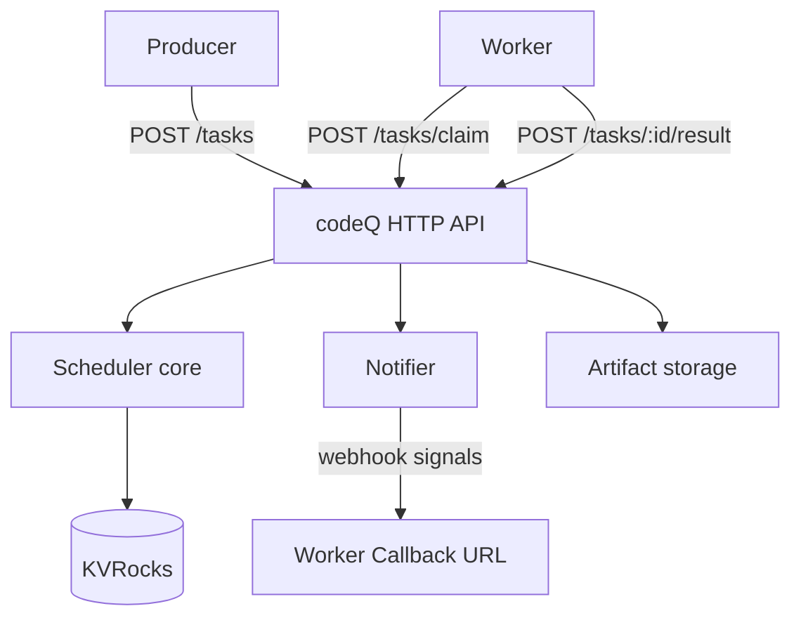
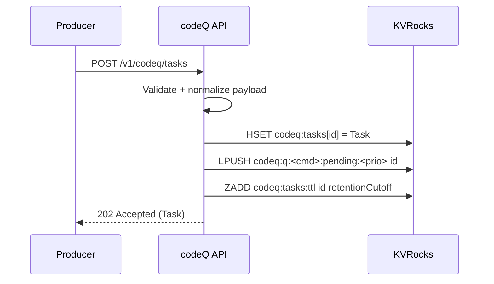
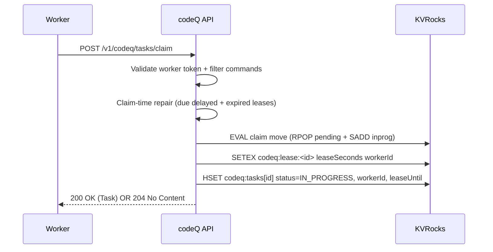
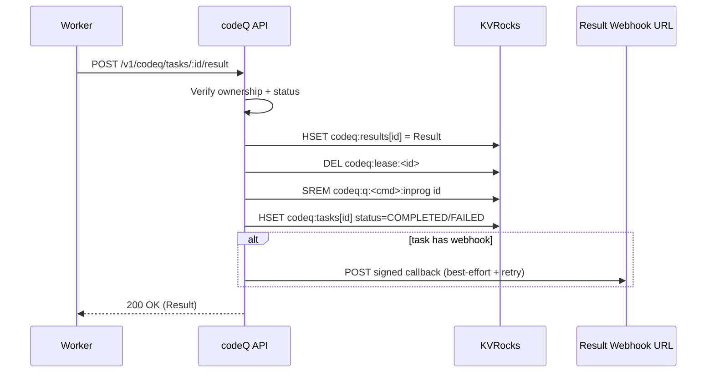
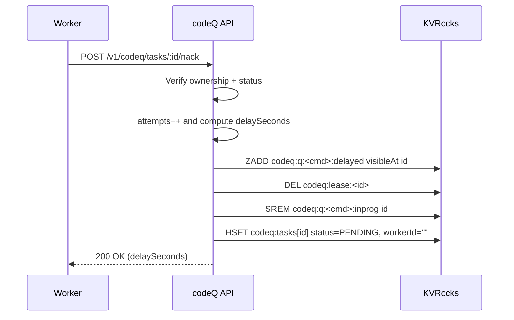

# Architecture

codeQ is implemented as a stateless HTTP API backed by a stateful KVRocks keyspace.

The service has no worker registry and no background "scheduler" that assigns tasks. Instead, the scheduler logic is embedded in claim and completion operations: claim-time repair moves due delayed tasks back to ready, detects expired or missing leases, and requeues work when needed.

## Component View

## Enqueue Flow

A producer creates a task by providing:

- `command` (event type)
- `payload`
- optional `priority`, `maxAttempts`, `idempotencyKey`
- optional task-level result callback `webhook`

The service validates and normalizes the payload, persists the task record, and inserts the task ID into the ready queue for that command.

## Claim Flow (Pull)

A worker claims tasks by command. Claim is intentionally narrow: "give me one task for one of these commands".

Claim includes a repair loop:

- move due delayed tasks back to ready
- requeue tasks that are in-progress but have missing/expired leases

Then it atomically pops one ID from pending and tracks it in in-progress via Lua (`RPOP` + `SADD`), sets a lease key with TTL, and updates the task record.

## Completion Flow

Completion is terminal: once a task is `COMPLETED` or `FAILED`, it is not automatically retried.

The service persists the result record, clears the lease, removes the task from in-progress, and optionally triggers a task-level result callback webhook.

## NACK + Retry

A nack transitions a task back into the delayed queue and clears ownership. The service computes the delay using the configured backoff policy (or a capped override).

## Push Without Assignment

codeQ implements two push paths:

- worker availability notifications: advisory signals that work is available for an event type
- result callbacks: task-level completion hooks

Both are described in [Webhooks](Webhooks).
