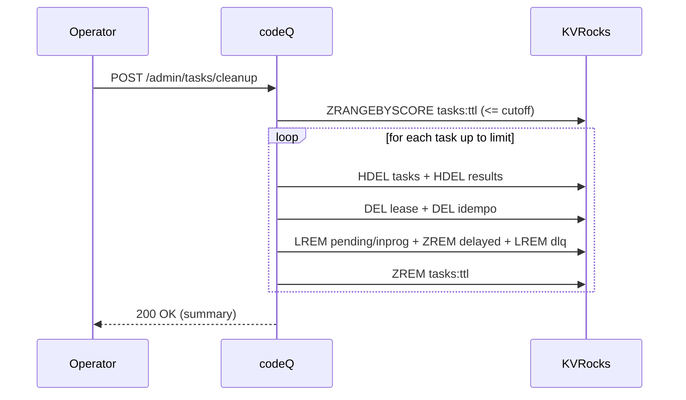

# Use Case: Admin Cleanup

This flow removes expired tasks and associated records from KVRocks.

codeQ retains tasks for a bounded window (default 24h) and deletes them via an explicit admin operation.

## Preconditions

- Caller is authorized as admin.
- A cutoff timestamp is chosen (typically "now - retention").

## Main flow

1. Operator calls `POST /v1/codeq/admin/tasks/cleanup`.
2. codeQ scans the retention index (`codeq:tasks:ttl`) for tasks whose retention cutoff is <= the requested cutoff.
3. For each selected task (bounded by `limit`), codeQ removes:
   - task record
   - result record
   - lease key
   - idempotency mapping (if present)
   - queue entries (pending, in-progress, delayed, DLQ)
4. The endpoint returns a summary of deletions.

## Sequence diagram

