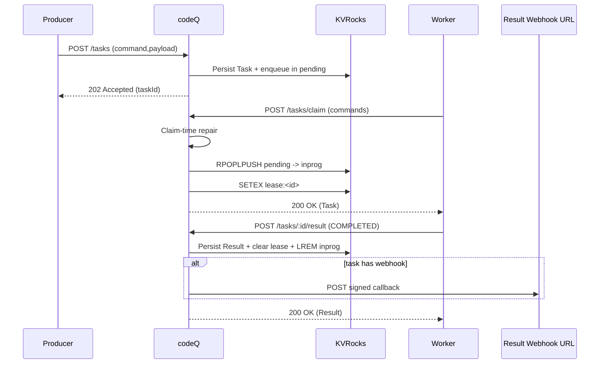

# Enqueue, Claim, Complete

This is the default pull-based execution flow.

## Preconditions

- Producer is authenticated and allowed to create tasks.
- Worker has a JWT with `codeq:claim` and `codeq:result`, and `eventTypes` includes the target command.

## Main flow

1. Producer calls `POST /v1/codeq/tasks` with `command` and `payload`.
2. codeQ persists the task and enqueues its ID into the pending queue for that command.
3. Worker calls `POST /v1/codeq/tasks/claim` with `commands=[command]`.
4. codeQ repairs due delayed tasks and expired leases, then moves one task ID to in-progress and sets a lease key.
5. Worker executes the task payload and submits `POST /v1/codeq/tasks/:id/result`.
6. codeQ validates ownership, persists the result, clears the lease, and removes the task ID from in-progress.
7. If the task includes a result callback webhook URL, codeQ posts a signed callback.

## Sequence diagram

