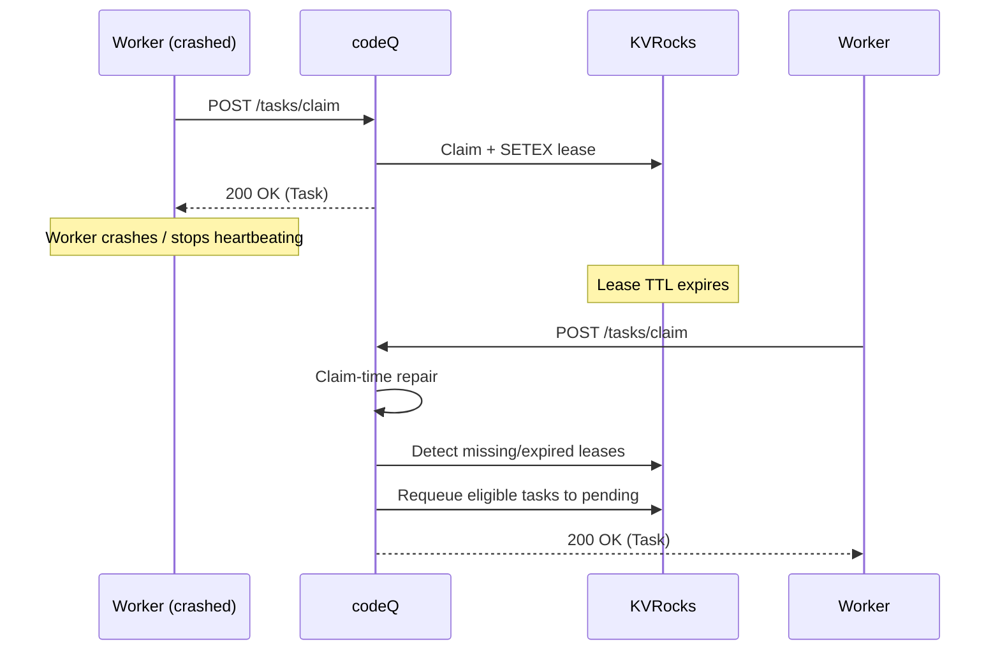

# Lease Expiry Repair

This flow shows how codeQ recovers from worker crashes and other lease-loss events.

The recovery mechanism is claim-time repair: codeQ does not run a background scanner; it repairs during `Claim` calls.

## Preconditions

- A task is `IN_PROGRESS` and listed in the in-progress queue.
- The lease key expires (worker crash, missed heartbeats, network partition, etc.).

## Main flow

1. Worker claims a task and receives a lease.
2. Worker fails to heartbeat and never submits a terminal result.
3. The lease key expires in KVRocks.
4. Another worker (or the same worker after restart) calls `POST /v1/codeq/tasks/claim`.
5. During claim-time repair, codeQ scans a bounded portion of the in-progress queue and detects tasks with missing/expired leases.
6. codeQ requeues those tasks back into the pending queue (or delayed queue depending on retry policy) so they can be claimed again.

## Sequence diagram

