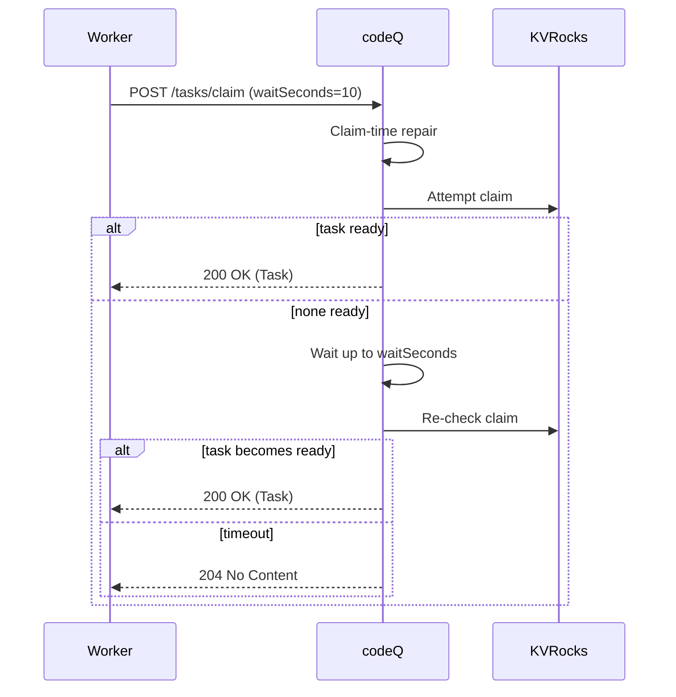

# Long-Poll Claim

This flow reduces idle polling by letting workers wait briefly for work to become available.

## Preconditions

- Worker has a JWT with `codeq:claim`.
- The worker requests `waitSeconds > 0` (max 30).

## Main flow

1. Worker calls `POST /v1/codeq/tasks/claim` with `waitSeconds`.
2. If a task is immediately available, codeQ returns `200` with the task.
3. If no task is available, codeQ blocks for up to `waitSeconds` waiting for work to become visible.
4. If work becomes ready during the wait window, codeQ claims it and returns `200`.
5. If the wait window expires without work, codeQ returns `204`.

## Sequence diagram

