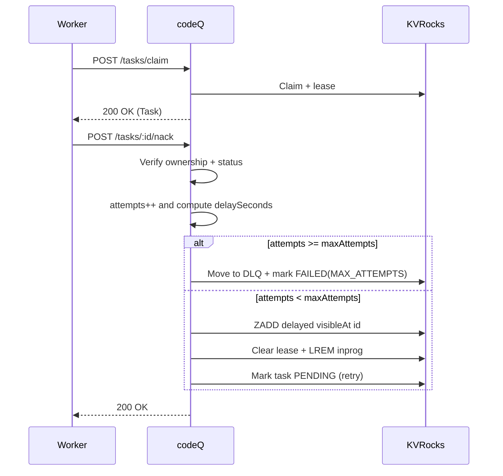

# NACK + Retry Backoff

This flow retries a task after a failure without marking it terminal.

## Preconditions

- Worker has a JWT with `codeq:claim` and `codeq:nack`.
- The task is currently `IN_PROGRESS` and owned by the worker (`sub == task.workerId`).

## Main flow

1. Worker claims a task.
2. Worker fails while processing and calls `POST /v1/codeq/tasks/:id/nack`.
3. codeQ verifies ownership and `IN_PROGRESS` status.
4. codeQ increments `attempts` and computes `delaySeconds` using the configured backoff policy (or a capped override).
5. If `attempts >= maxAttempts`, codeQ moves the task to DLQ and marks it `FAILED` with `error=MAX_ATTEMPTS`.
6. Otherwise, codeQ moves the task to the delayed queue with `visibleAt = now + delaySeconds`, clears the lease, and removes the task from in-progress.
7. On future claims, claim-time repair moves due delayed tasks back to pending.

## Sequence diagram

