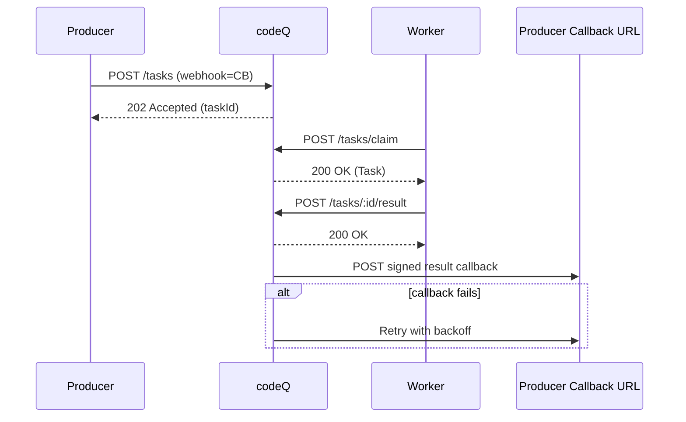

# Use Case: Result Callbacks

This flow uses task-level webhooks to avoid polling `GET /tasks/:id/result`.

## Preconditions

- Producer creates the task with a `webhook` URL.
- Producer can validate callback signatures.

## Main flow

1. Producer calls `POST /v1/codeq/tasks` with the `webhook` field.
2. codeQ stores the webhook URL in the task record.
3. Worker claims and completes the task.
4. When the task reaches `COMPLETED` or `FAILED`, codeQ POSTs a signed callback with the result payload.
5. If delivery fails, codeQ retries with exponential backoff (bounded by configuration).
6. Producer deduplicates callbacks by `taskId` (at-least-once delivery).

## Sequence diagram

