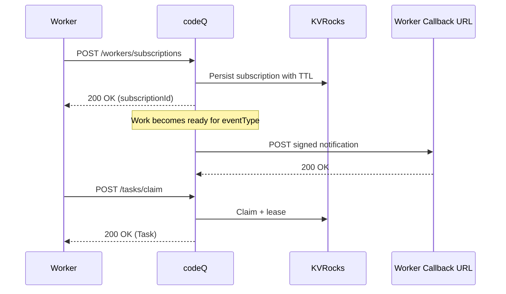

# Worker Availability Webhook

This flow uses webhook notifications to reduce idle worker polling.

Notifications are advisory. They do not assign tasks and they do not change task ownership. A worker must still claim via `POST /v1/codeq/tasks/claim`.

## Preconditions

- Worker has a JWT with `codeq:subscribe`.
- Worker provides a reachable `callbackUrl`.

## Main flow

1. Worker registers a subscription using `POST /v1/codeq/workers/subscriptions`.
2. codeQ stores the subscription with TTL and requires renewal.
3. When work becomes available for an event type (queue transitions non-empty, delayed becomes due, requeue makes ready), codeQ sends a signed webhook notification.
4. Worker validates signature and timestamp.
5. Worker calls `POST /v1/codeq/tasks/claim` to obtain ownership.

## Sequence diagram

